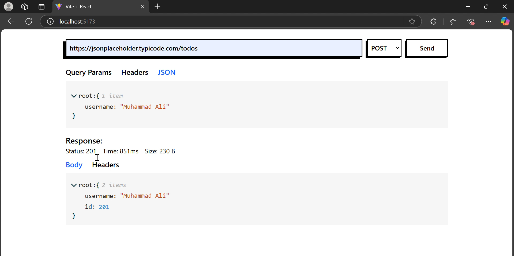

# HTTP/HTTPS API TESTING TOOL 🌐

This is a web application that allows users to send HTTP/S requests to an API. You can define the URL, query parameters, headers, and JSON body, then send the request using `axios`. The response is displayed with details such as the status code, time taken, data size, response body, and response headers.



## Features ✨
- **Define URL**: Enter the API endpoint URL.
- **Set Parameters**: Add query parameters to the URL.
- **Custom Headers**: Configure custom request headers.
- **JSON Body**: Edit and define the JSON body of the request.
- **Send Request**: Send the request to the specified API.
- **View Response**: See the response details including:
  - **Status Code**
  - **Time Taken**
  - **Data Size**
  - **Response Body**
  - **Response Headers**
  
### Tech Stack 💻
- **React.js**: For building the user interface and managing application state.
- **Tailwind CSS**: For responsive and easy styling.
- **Axios**: For making HTTP requests.
- **json-edit-react**: For editing and displaying JSON data in an editable format.
- **pretty-bytes**: For calculating the size of the data received in a human-readable format.

## Installation 🛠️

### Prerequisites
Make sure you have `Node.js` and `npm` installed on your system.

### Steps

1. Clone the repository:
   ```bash
   git clone https://github.com/MuhammadAli990/HTTP-HTTPS-API-TESTING-TOOL.git
   cd your-repo-name
   ```

2. Install dependencies:
    ```bash
    npm install
    ```

3. Start the development server:
    ```bash
    npm run dev
    ```

4. Open your browser and visit http://localhost:3000 to access the application.